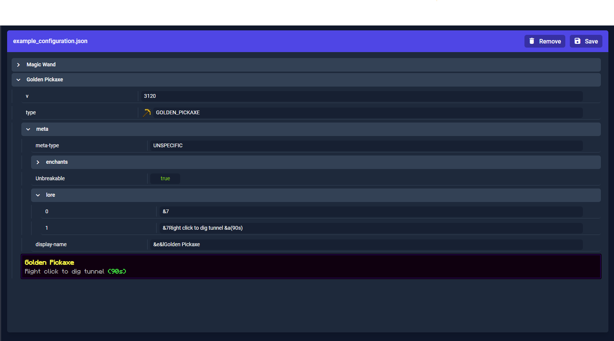

<h1 align="center">
   
  
   
  McConfig | YAML & JSON Config Editor
   
</h1>

<h4 align="center">Mc config is a graphic editor for YAML & JSON files. It has an extra support for minecraft configs, such as items display name and lore preview. McConfig is written with Angular & NgRx!</h4>

  <a href="#key-features">Key Features</a> •
  <a href="#deployed-app">Deployed App</a>

## Key Features

- Nice looking graphical editor.
- Uploading, Editing and Downloading files.
- Editing field types (string, number, boolean, array, object).
- Minecraft text preview (support for color codes and hex color codes).

## Deployed App

You can view the app here:
https://mintmissy.github.io/McConfig/

## Issues During Development

During development I had one major issue - all config nodes were updating after any change. After making little research I've discovered a `trackBy` function that can be used create custom tracking logic for ngFor directive. Thanks to this function editor is now much more performant.

## Ideas for Improvement

- [X] Add new key
- [X] Edit existing key
- [X] Change field type
- [X] Clone object in lists
- [ ] Add code editor (switching between gui/text editor)
- [ ] Add option to select file save format - json/yaml
- [ ] Add filter keys functionality
